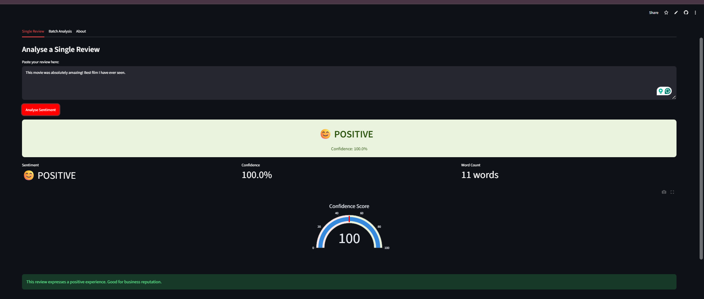

# nlp-sentiment-pipeline
NLP Sentiment Analysis using DistilBERT + Streamlit
# NLP Sentiment Pipeline

NLP Sentiment Analysis using DistilBERT + Streamlit

## Problem Statement
Businesses receive thousands of product and movie reviews daily. This project automatically classifies each review as Positive or Negative using DistilBERT transformer model.

## Live App
[Click here to try the app](https://nlp-sentiment-pipeline-zncmnheeohd24u2uxzakky.streamlit.app)

## App Screenshot

## Tech Stack
- Python
- HuggingFace Transformers
- DistilBERT
- Scikit-learn
- Streamlit + Plotly
- MLflow

## Key Results
- Baseline TF-IDF AUC: ~0.93
- DistilBERT AUC: ~0.97
- Dataset: IMDB Movie Reviews (50,000 samples)

## How to Run
pip install -r requirements.txt
streamlit run sentiment_app.py

---
Built by Bhavana Aswin | B.Tech CS (AI) | Data Scientist
